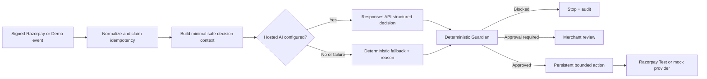
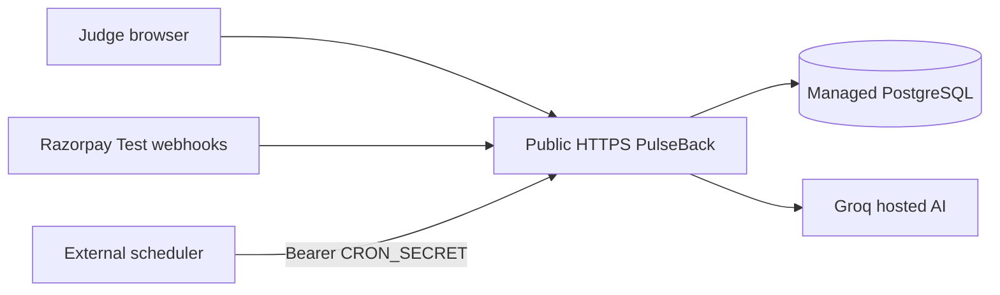

# PulseBack architecture

## Trust and authority boundaries

1. Razorpay and hosted-AI secrets exist only in server configuration and adapters.
2. Raw Razorpay webhook bytes are authenticated before parsing or mutation.
3. Razorpay and simulator events normalize into one `RecoveryEventInput` pipeline.
4. AI receives a small `RecoveryDecisionContext`, not raw database rows or webhook payloads.
5. Provider strings are untrusted, length-limited, identifier-redacted data. Instruction-like text is omitted and flagged.
6. The selected hosted provider produces a strict `RecoveryDecision`; it does not execute actions or control funds.
7. Deterministic Guardian evaluates every recommendation after AI and before execution.
8. PostgreSQL idempotency and transactional state changes remain authoritative.

## Decision flow

The resolver classifies `NOT_CONFIGURED`, `TIMEOUT`, `RATE_LIMIT`, `INVALID_RESPONSE`, and `API_ERROR`. The fallback decision goes through the same Guardian and persistence path.

## Data sent to the hosted AI provider

- Transaction amount in paise, currency, coarse payment method, normalized failure evidence, attempt count, and elapsed time
- Internal opaque customer ID and aggregate payment/recovery/contact/fatigue counts
- Current case state and bounded previous action summaries
- Guardian policy summary and known risk flags

Excluded: names, email, phone, card data, full provider identifiers, API keys, webhook secrets, database credentials, raw payloads, and arbitrary internal metadata.

## Persistence and audit

`RecoveryDecision` stores category, diagnosis, action, confidence, probability, explanation, evidence, risk flags, wait, friction, urgency, provider, model, fallback reason, Guardian decision/reasons, and timestamp. Re-analysis inserts a new decision, cancels superseded pending actions, creates at most one new pending plan, and records append-only audit events.

## Idempotency and execution safety

- Unique `(provider, providerEventId)` database constraint
- Stable signed-body digest fallback for events without an ID header
- Unique action provider references and active-link reuse
- Atomic action execution claim
- Exact link, reference, and paise amount required before recovery is counted
- Late authorization cancels pending contact and marks self-recovery
- Hosted AI never runs inside the action executor or Recovery Lab

## Hosted runtime

`DATABASE_URL` is the pooled/serverless application connection. `DIRECT_URL` is used only by Prisma migration and intentional seed commands. Prisma is cached per runtime instance with a bounded pool. Generic Node hosts use the `pg` adapter; Workers-compatible deployments use the Neon serverless adapter and never open a raw TCP socket.

Public mutation routes consume shared PostgreSQL rate-limit buckets. The signed Razorpay webhook is excluded from arbitrary throttling and continues to rely on raw-body HMAC verification plus durable idempotency. Client-facing route errors are generic; redacted diagnostics remain server-side.

Email execution is behind `NotificationProvider`. This phase resolves it only to `MockNotificationProvider`, so no email, SMS, or WhatsApp message leaves PulseBack. A real email adapter is the next planned integration.
