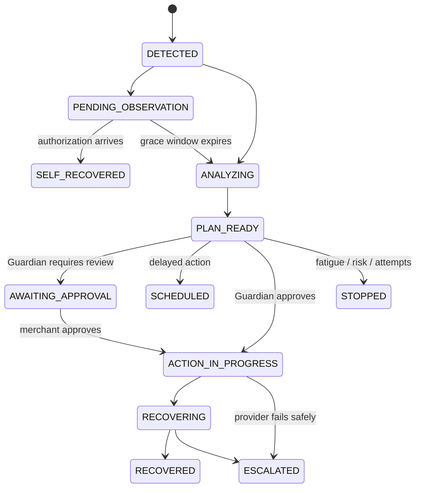

# PulseBack Architecture

## Design principles

1. **The AI has advisory authority only.** It returns a validated diagnosis and proposed strategy.
2. **Guardian is deterministic.** Amount, attempts, fatigue, contacts, risk, confidence and idempotency are code and policy values.
3. **Execution is adapter-driven.** Mock and Razorpay providers implement the same interface.
4. **State transitions are explicit.** Invalid transitions throw and are testable.
5. **Events are idempotent.** Provider event IDs and case-level active-link checks prevent duplicated effects.
6. **Synthetic evidence stays honest.** Recovery Lab numbers are reproducible simulations, not production claims.

## Recovery lifecycle

## Domain layers

- `domain/recovery` owns typed states, actions, monetary scoring and transitions.
- `domain/guardian` evaluates policy without network or UI dependencies.
- `domain/evaluation` generates seeded cases and evaluates both strategies using identical outcome draws.
- `lib/ai` owns structured decision engines and deterministic fallback.
- `lib/razorpay` owns provider contracts, raw-body signatures and Test Mode API requests.
- `services` coordinates idempotent events and bounded recovery execution.
- `repositories` selects the PostgreSQL or zero-config demo provider and keeps persistence out of React.
- `prisma` defines the PostgreSQL schema, migration history and deterministic seed.
- `app/api` validates requests and exposes only server-safe operations.
- `components` renders merchant-facing evidence and interactive demo controls.

## Relational persistence model

The primary Prisma/PostgreSQL adapter persists `Merchant`, `Customer`, `Payment`, `RecoveryCase`, `RecoveryDecision`, `RecoveryAction`, `AuditEvent`, `WebhookEvent`, `Policy`, and `EvaluationRun`. Important constraints:

- unique `(provider, providerEventId)` on webhooks;
- unique active Payment Link per recovery case;
- indexes on `(merchantId, status, expectedRecoverableValue)` and `(recoveryCaseId, createdAt)`;
- amount and recovered value stored as integer paise;
- audit metadata as JSONB, with append-only application permissions;
- tenant/merchant ID on every durable record.

When `DATABASE_URL` is absent and `DEMO_MODE=true`, the repository factory selects the deterministic in-memory fallback. Sites is Worker-based, so a hosted PostgreSQL deployment uses the Neon serverless Prisma adapter; local/Node deployments use the Prisma PostgreSQL adapter. Both implementations expose the same repository contract.

## Failure handling

Provider execution reserves the case/idempotency boundary before creating a Payment Link. If the provider throws, no link ID is recorded, no customer delivery is claimed, the attempt counter increments once, the case becomes `ESCALATED`, and the audit message is intentionally non-technical.

## Late authorization

Ambiguous bank/network failures enter `PENDING_OBSERVATION`. Authorization or capture during the window transitions directly to `SELF_RECOVERED`, removes `nextActionAt`, cancels any pending recovery and records that no customer contact occurred.
