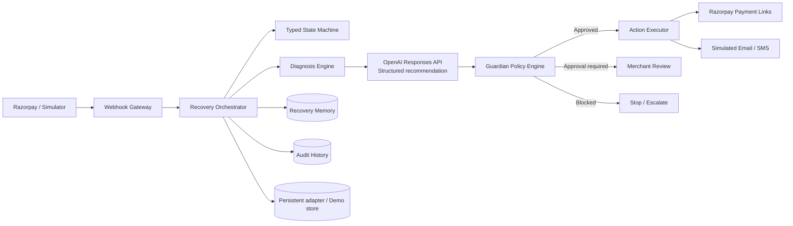

# PulseBack

**AI Revenue Recovery Autopilot**

> Failed doesn’t mean lost.

PulseBack is a safe, explainable recovery layer that sits beside Razorpay. It detects failed payments, diagnoses the likely cause, predicts the most suitable intervention, passes that proposal through deterministic financial policies, executes or schedules the bounded action, and records the full outcome.

Built for the Razorpay AI Buildathon — Track 03: AI Revenue Recovery.

## Problem

Payment failures, abandoned checkouts, network timeouts and failed recurring charges can erase revenue after purchase intent already exists. A naïve retry system either leaves money behind or over-contacts customers. Financial automation needs context, state, stopping rules and an auditable authorization boundary.

## Solution

PulseBack combines a typed recovery state machine, customer recovery memory, an AI diagnosis layer, the deterministic **Guardian** policy engine, idempotent provider adapters and measurable outcomes.

The authority model is intentionally simple:

**AI recommends → Guardian authorizes → Executor acts**

The AI never receives unrestricted provider tools or direct financial authority.

## What makes PulseBack different

- **Recovery Opportunity Score** — deterministic 0–100 priority using amount, predicted probability, history, attempts, fatigue, risk and duplicate-link state.
- **Payment Autopsy** — concise evidence and merchant-facing diagnosis without hidden chain-of-thought.
- **Late Authorization Guard** — observes ambiguous network failures and cancels recovery if authorization arrives late.
- **Recovery Memory** — customer-level successes, attempts, contacts, preferences and fatigue shape every new case.
- **Guardian** — editable limits for amount, attempts, contacts, confidence, risk and repeated actions.
- **Shadow / Approval / Autopilot modes** — merchant-controlled authority.
- **What If? simulator** — compares predicted recovery, value and friction across possible interventions.
- **Revenue Leak Map** — shows failure category → intervention → outcome.
- **Recovery Lab** — reproducible seeded comparison of Baseline vs PulseBack over 50–500 identical synthetic cases.
- **Graceful provider failure** — a built-in action failure proves that duplicates are prevented and the case escalates safely.

## Architecture



PulseBack now uses a repository boundary with PostgreSQL as the primary implementation and a deterministic in-memory provider when `DATABASE_URL` is absent and `DEMO_MODE=true`. Event processing, Guardian evaluation, case actions, due-action execution and audit writes stay behind server-side services rather than React components.

## Opportunity score

The score combines:

`probability value + log-adjusted amount + successful history + category weight − attempts − fatigue − risk − staleness − duplicate-link penalty`

Expected recoverable value is `amount × adjusted recovery probability`. Both are deterministic and unit-tested; the AI does not invent these numbers.

## Quick start

Requirements: Node.js 22.13 or newer.

```bash
npm install
copy .env.example .env
npm run dev
```

Open `http://localhost:3000`. The default is zero-credential demo mode.

## PostgreSQL setup

PostgreSQL is the primary Phase 2 data store. Monetary values are stored as integer paise. Prisma migrations use `DIRECT_URL`; the application runtime uses `DATABASE_URL`.

- Local PostgreSQL or a Node-hosted deployment: set `DATABASE_DRIVER=pg` and `DATABASE_RUNTIME=node`. `DATABASE_URL` may be the normal pooled application connection and `DIRECT_URL` should be the direct migration connection. Start it with `npm run dev:postgres`.
- Sites/Cloudflare deployment: use Neon PostgreSQL, `DATABASE_DRIVER=neon`, and `DATABASE_RUNTIME=workerd`. Use the Neon pooled/serverless URL for `DATABASE_URL` and its direct PostgreSQL URL for `DIRECT_URL`, because the hosted worker cannot open arbitrary raw TCP database sockets.

```bash
npm install
npm run db:generate
npm run db:deploy
npm run db:seed
npm run dev
```

For development migration work use `npm run db:migrate`. To recreate only a development database use `npm run db:reset`, followed by `npm run db:seed` if the reset prompt did not run the configured seed.

## Demo mode

With `DEMO_MODE=true` and no `DATABASE_URL`, PulseBack uses the zero-config repository fallback with:

- seeded Indian merchant-style customers and INR payments;
- `MockDecisionEngine` with explainable failure heuristics;
- an idempotent `MockPaymentProvider`;
- simulated email/SMS delivery;
- accelerated event scenarios and due-action processing;
- a deterministic Recovery Lab with visible seed `PULSEBACK-2026`.

Synthetic metrics are labeled **Synthetic benchmark results**. Provider actions are labeled simulated. No production performance claim is made.

## Razorpay Test Mode setup

1. Create or use a Razorpay Test Mode account.
2. Add the Test Mode key ID and secret to `.env.local`.
3. Set `NEXT_PUBLIC_RAZORPAY_KEY_ID` to the same public Test Mode key ID.
4. Create a strong webhook secret in Razorpay.
5. Set the webhook URL to `https://YOUR_HOST/api/webhooks/razorpay`.
6. Subscribe to `payment.failed`, `payment.authorized`, `payment.captured`, `payment_link.paid`, `payment_link.expired`, and `payment_link.cancelled`.
7. Put that exact webhook secret in `RAZORPAY_WEBHOOK_SECRET` and restart the server.

Webhook processing reads the raw body, verifies `X-Razorpay-Signature` with HMAC SHA-256, requires `x-razorpay-event-id`, ignores duplicates idempotently and accepts no unsigned webhook outside demo mode. Batch evaluation never calls Razorpay or consumes Test Mode Payment Links.

## OpenAI setup

Set `OPENAI_API_KEY` and optionally `OPENAI_MODEL`. The server uses the official OpenAI SDK and Responses API with a strict JSON schema validated by Zod. Invalid output falls back to deterministic heuristics and is designed to create an audit event. Keys and model calls remain server-side.

## Routes

| Route | Purpose |
| --- | --- |
| `/` | Revenue recovery overview and opportunity queue |
| `/recoveries` | Searchable, filtered recovery queue |
| `/recoveries/[id]` | Autopsy, AI proposal, Guardian, What If?, timeline and raw audit |
| `/leaks` | Interactive revenue leak flow and category effectiveness |
| `/lab` | Deterministic Baseline vs PulseBack benchmark |
| `/policies` | Editable Guardian and operating-mode controls |
| `/audit` | Filterable human-readable audit history |
| `/integrations` | Credential-safe integration health |
| `/demo` | Judge-friendly scripted scenarios |
| `/demo/events` | Internal event simulator using the recovery pipeline |
| `/demo/checkout` | Razorpay Standard Checkout Test Mode adapter |

## Security model

- Razorpay, OpenAI, database and cron secrets are server-only.
- Webhooks use raw-body HMAC verification and unique provider event IDs.
- Checkout signatures are verified server-side.
- Incoming API payloads are validated with Zod.
- Monetary values are paise in domain and API layers.
- Card numbers and CVV are never collected or stored by PulseBack.
- One active Payment Link per case is enforced before provider execution.
- The AI proposes structured decisions; only Guardian can authorize execution.
- Failed provider actions do not blindly retry or create duplicates.

## Testing

```bash
npm run lint
npm run typecheck
npm test
npm run build
```

The test suite covers scoring, amount policy, fatigue, signature verification, persistent repository idempotency, case approval and stopping, operating-mode semantics, late authorization, duplicate links, due actions, dashboard aggregation, seeded evaluation and safe provider failure.

## Tech stack

Next.js-compatible App Router on Vinext, TypeScript, React 19, Tailwind CSS, Lucide, Recharts, Zod, official OpenAI SDK and Vitest. Sites produces a Cloudflare Worker-compatible ESM build.

## Further work

- Authentication, merchant onboarding and row-level multi-tenant isolation.
- Real email, SMS and WhatsApp adapters with opt-out handling.
- Subscription and B2B invoice recovery.
- Merchant-specific recovery models and contextual bandits.
- Checkout abandonment telemetry and learned time-to-contact.

See [ARCHITECTURE.md](./ARCHITECTURE.md), [SETUP.md](./SETUP.md), [DEMO_SCRIPT.md](./DEMO_SCRIPT.md) and [JUDGING_NOTES.md](./JUDGING_NOTES.md).
