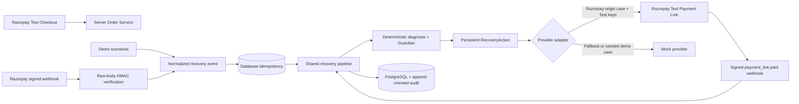

# PulseBack

**AI Revenue Recovery Autopilot — Razorpay Test Mode build**

> Failed does not mean lost.

PulseBack detects failed payments, creates persistent recovery cases, applies deterministic Guardian policies, executes a bounded recovery action, and records the result. Phase 3 integrates the genuine Razorpay Test API and signed webhooks without enabling live money movement.

Built for the Razorpay AI Buildathon — Track 03: AI Revenue Recovery.

## Current authority model

**Deterministic diagnosis recommends → Guardian authorizes → provider adapter acts**

OpenAI is not called in Phase 3. The existing deterministic engine remains the decision source. Real email and SMS are also disabled.

## What is real in Phase 3

- Razorpay Test Orders are created server-side and persisted as `ProviderOrder` records.
- Standard Checkout uses only a public `rzp_test_` key; card data never enters PulseBack.
- Checkout signatures and raw webhook bodies are verified server-side with HMAC SHA-256.
- `payment.failed`, `payment.authorized`, `payment.captured`, `payment_link.paid`, `payment_link.expired`, and `payment_link.cancelled` enter the same recovery pipeline as the demo simulator.
- Failed-payment metadata, provider IDs, orders, cases, decisions, actions, and audit events persist in PostgreSQL.
- Razorpay Test Payment Links are created through the server-side provider adapter, stored on the original action, and reused instead of duplicated.
- A paid link must match the stored link ID, case reference, and exact paise amount before recovery is counted.
- Unique `(provider, providerEventId)` storage makes webhook replay safe across restarts. If Razorpay omits an event-ID header, PulseBack derives a stable ID from the signed raw body.
- Expired or cancelled links never count recovery.

## Safe fallback

If Test credentials are absent, PulseBack clearly reports **Demo Provider active** and uses `MockPaymentProvider`. If `DATABASE_URL` is also absent and `DEMO_MODE=true`, the repository uses its deterministic in-memory fallback. Live `rzp_live_` credentials are explicitly rejected in this hackathon build.

## Architecture



React components never receive Razorpay secrets and do not query arbitrary database tables. Routes call services; services use repository/provider boundaries.

## Quick start

Requirements: Node.js 22.13+ and PostgreSQL 15+ for persistent mode.

```powershell
npm install
Copy-Item .env.example .env.local
npm run db:deploy
npm run db:seed
npm run dev:postgres
```

Open `http://localhost:3000`.

See [SETUP.md](./SETUP.md) for exact database, Test Mode webhook, and local public-host instructions.

## Razorpay Test Mode configuration

Set these variables in `.env.local`:

```text
NEXT_PUBLIC_RAZORPAY_KEY_ID
RAZORPAY_KEY_ID
RAZORPAY_KEY_SECRET
RAZORPAY_WEBHOOK_SECRET
```

Both key IDs must be the same `rzp_test_...` value. Configure the Razorpay Test webhook URL as:

```text
https://YOUR_PUBLIC_HOST/api/webhooks/razorpay
```

Subscribe to:

- `payment.failed`
- `payment.authorized`
- `payment.captured`
- `payment_link.paid`
- `payment_link.expired`
- `payment_link.cancelled`

No real money is involved in Test Mode.

## PostgreSQL

Amounts are integer paise. Prisma persists `Merchant`, `Customer`, `ProviderOrder`, `Payment`, `RecoveryCase`, `RecoveryDecision`, `RecoveryAction`, `AuditEvent`, `WebhookEvent`, `Policy`, and `EvaluationRun`.

- Local PostgreSQL/Node: `DATABASE_DRIVER=pg`, `DATABASE_RUNTIME=node`, run `npm run dev:postgres`.
- Sites/Cloudflare: use Neon, `DATABASE_DRIVER=neon`, `DATABASE_RUNTIME=workerd`; use its pooled/serverless URL for `DATABASE_URL` and direct URL for `DIRECT_URL`.

## Verification

```powershell
npm run lint
npm run typecheck
npm test
npm run verify:phase3
npm run build
npm audit --omit=dev
```

`verify:phase3` requires a seeded PostgreSQL database. It uses a Razorpay-origin event with the provider fallback, then proves durable case creation, one link action, exact-amount recovery, and duplicate suppression. Unit tests separately verify the real Razorpay HTTP adapter and error mapping without spending money or requiring credentials.

## Main routes

| Route              | Purpose                                                   |
| ------------------ | --------------------------------------------------------- |
| `/`                | Database-backed recovery overview                         |
| `/recoveries`      | Persistent recovery queue with Test/Demo provenance       |
| `/recoveries/[id]` | Diagnosis, Guardian, actions, provider link, and timeline |
| `/integrations`    | Safe Razorpay Test connection status and event counts     |
| `/demo`            | Stateful internal scenarios using the shared pipeline     |
| `/demo/checkout`   | Razorpay Test Order + Standard Checkout flow              |
| `/audit`           | Persistent append-oriented audit trail                    |
| `/policies`        | Persistent Guardian and operating mode                    |
| `/lab`             | Deterministic synthetic benchmark                         |

## Deliberately simulated or deferred

- OpenAI and all LLM calls
- Real email, SMS, or WhatsApp delivery
- Live Razorpay credentials and live money movement
- Authentication, production merchant onboarding, and multi-tenant isolation
- Recovery Lab cases remain synthetic; only run summaries persist

See [ARCHITECTURE.md](./ARCHITECTURE.md), [DEMO_SCRIPT.md](./DEMO_SCRIPT.md), and [JUDGING_NOTES.md](./JUDGING_NOTES.md).
